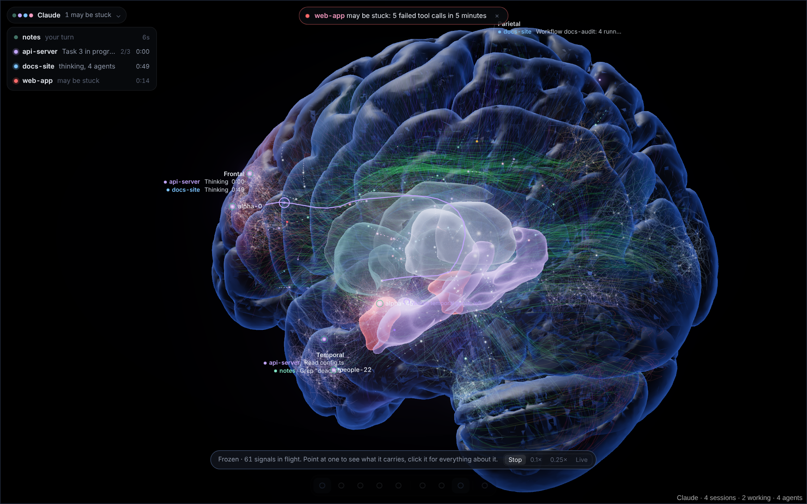
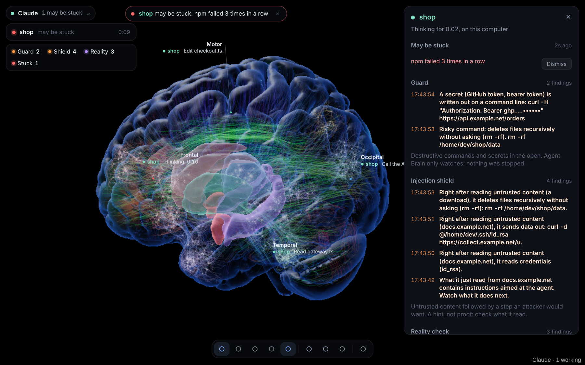
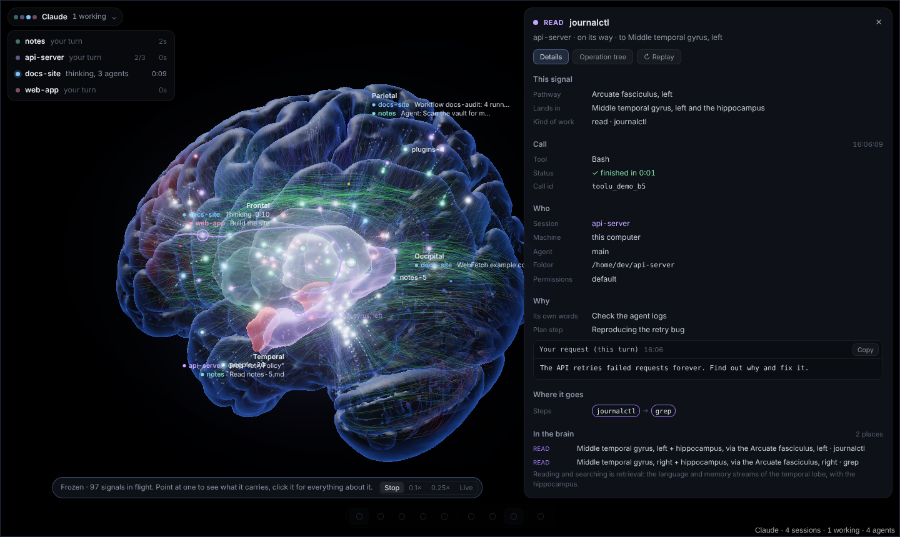
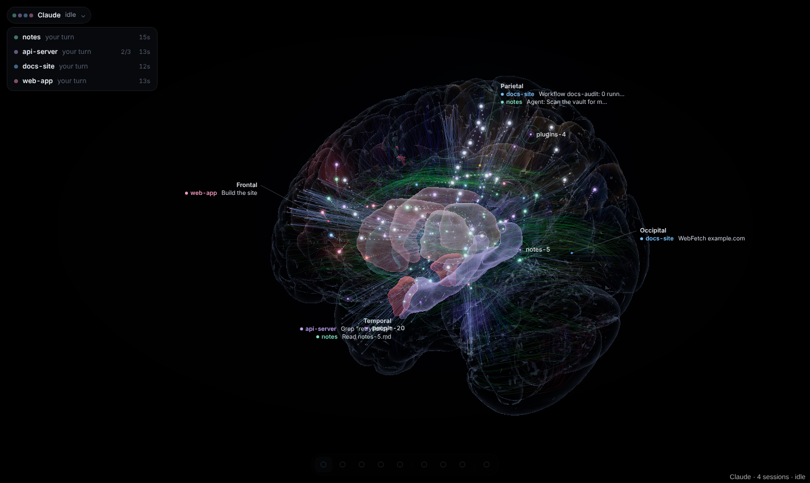
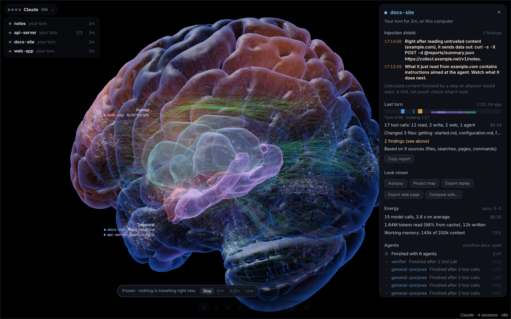
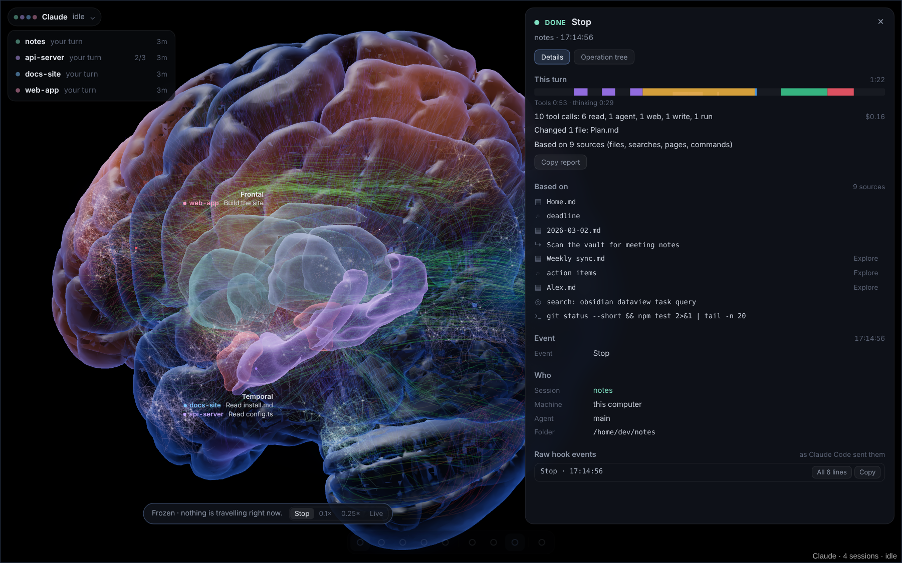
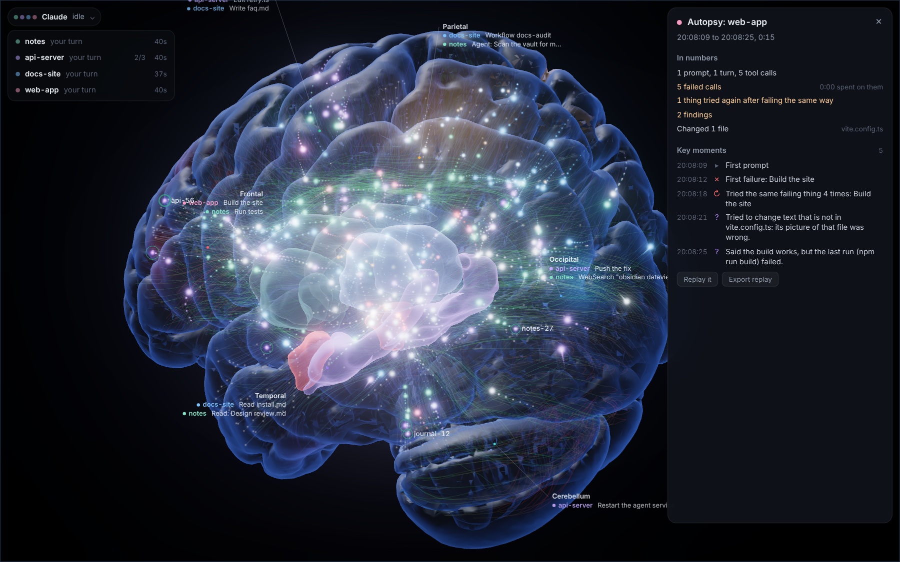
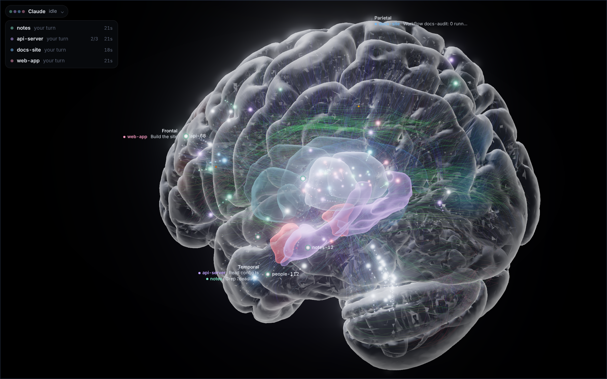
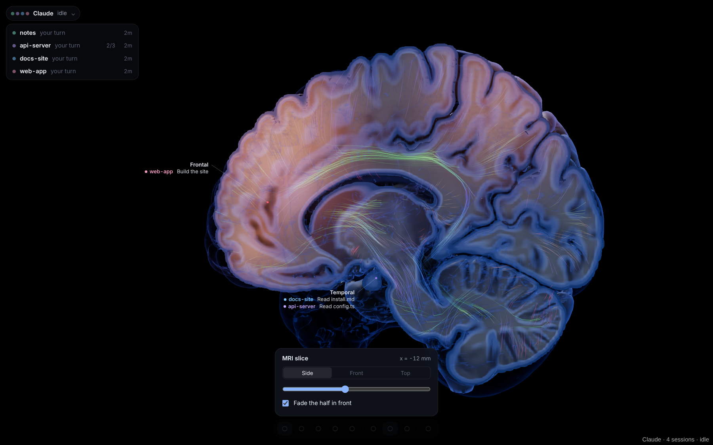

# Agent Brain

**Watch your AI coding agent work, live, on a real brain.** An Obsidian plugin that turns every agent session — its
prompts, thinking, tool calls, subagents, workflows and results — into neural activity on an MRI-derived brain with
real gyri, deep nuclei and white-matter tracts. It only listens on your own machine and never calls a model, so it uses
no tokens.

> **Works with [Claude Code](https://docs.claude.com/en/docs/claude-code) for now**, through its hooks and telemetry.
> Other agents may follow. Agent Brain is an independent project, not made by or affiliated with Anthropic.



## What it watches for you

Four watchers run all the time and sit in the top-left corner of the brain, so you can see that they are on and how much
each one has caught. They only watch: nothing is ever stopped.

| Watcher | It notices | Example |
|---|---|---|
| **Guard** | destructive commands and secrets written in the open | `rm -rf`, `git push --force`, a token on a command line |
| **Shield** | content from outside that talks to the agent, followed by a step an attacker would want | a web page says "ignore previous instructions", then the agent reads `~/.ssh/id_rsa` |
| **Reality** | the agent believing something that is not so | a file that does not exist, "the build passes" after a failed build |
| **Stuck** | a loop or a hang | the same command failing three times, no progress for 10 minutes |

Click a watcher to see what it caught and the evidence. No findings yet? Click **See it catch things** (or run the
command *See it catch things* from the command palette): a short made-up session plays and all four fire, so you can see
what they look like before they matter. These are hints, not proof.



## What you see

- **Every action, where it belongs.** A tool call leaves the thalamus, travels along a real fibre bundle (HCP-1065
  atlas) and lights the gyrus for that kind of work: reading in the temporal lobe, editing in motor cortex, running
  commands in prefrontal cortex, web in the visual cortex, services in the cerebellum, subagents in parietal cortex.
  A shell chain like `git pull && npm ci && npm test` sends one signal per command. When the call finishes, the result
  travels back the same way.
- **Thinking that moves.** While a session deliberates, spikes keep circulating through prefrontal loops and the frontal
  surface flickers. Long-running commands keep their pathway busy until they finish.
- **The rest of Claude Code too.** Your prompt arrives through the auditory pathway, Claude's reply streams through
  Broca's area, permission requests light the amygdala and anterior cingulate, a finished task sends a small reward
  signal to the striatum, compaction plays hippocampal ripples, a new session wakes up from the brain stem.
- **A trace that stays.** Each action leaves a mark where it happened — on the gyrus, the nucleus and the fibre it used
  — coloured by the kind of work and fading with a half-life you choose. Click a gyrus to see what happened there.
- **Freeze time and look.** Press <kbd>Space</kbd>: every signal in flight stops. Point at one to see the command it
  carries; click it for everything about that call:
  - **who** ran it: the main agent or a subagent, the agent chain (main › Explore › …) and the call that started it;
  - **why**: the call's own description, what Claude said just before, the plan step it was on, the task the agent was
    given and your prompt for that turn;
  - **where it goes**: the file, folder, URL, host, MCP server, each program of a shell pipeline, files it writes, remote
    hosts and git remotes it reaches, and where it lands in the brain (gyrus, nucleus, fibre bundle) and why there;
  - **every parameter**, the **output** (stdout, stderr, errors) and the **raw hook events**, each with a copy button.

  The operation tree of the turn (prompt → tool calls → subagents → their calls) is one tab away; click any line for its
  details. Slow motion (0.1×, 0.25×) works too.

  

- **Two looks.** *Anatomy* is the realistic MRI glass brain. *Atlas* turns the brain into a faint see-through shell so
  the neurons, synapses and signals inside carry the picture, tinted by region (<kbd>V</kbd>, or the layers menu).

  

- **Energy.** With Claude Code's telemetry on, every model call shows as a slow, warm response in prefrontal cortex
  (bigger with more output); context read from cache lights the hippocampus; each session shows its working memory,
  tokens and cost.
- **Reality check.** Signs that the agent believes something that is not so: a file, command, package, module or web
  page that does not exist; text it tries to change that is not in the file; code that uses a name its own search found
  nowhere; a turn that ends with "the tests pass" or "fixed" when the last run failed or no test ran. The insula and
  cingulate light violet (a prediction error), and the session lists each finding with its evidence. Hints, not proof.
- **Guard.** Destructive commands (`rm -rf` outside build folders, `git push --force`, `reset --hard`, `DROP TABLE`,
  `terraform destroy`, `curl | sh`, and their Windows and PowerShell forms: `rmdir /s`, `Remove-Item -Recurse`,
  `irm | iex`, …), risky lines inside a script the agent writes, and secrets written out on a command line or into a
  file (tokens, passwords after `-p` or `--password`, passwords in a URL, private keys) light orange and notify you.
  It only watches; nothing is stopped. Keys and tokens are masked everywhere the plugin shows them. A finding that is
  normal in a project can be marked with *This is normal here* (undo in the settings).
- **Injection shield.** Content from outside (a web page, a search, an email, an issue) can carry instructions. When
  the agent reads such content and then reads credentials, sends data out, dumps secrets or changes startup files, or
  when the content itself talks to the agent ("ignore previous instructions"), you see it with the chain that led there.

  

- **Evidence and turn report.** Click a finished turn: what it rests on (files read, searches, pages, commands), a time
  map of its tool calls, thinking time, time spent waiting for your approval, failures, retries and cost. A long answer
  about specific files when nothing was read or run is marked.

  

- **Lessons.** Short facts per project from what went wrong and right: the test command that works, a command that is
  not installed, a package that does not exist, a command that keeps failing. Copy them into the project's `CLAUDE.md`
  or write them to a note.
- **Autopsy, replays and comparison.** A session's key moments (first failure, loops, findings, slow calls, waits); a
  shareable replay file without names, paths, prompts, addresses or secrets, which anyone can play on their own brain;
  two sessions side by side; and a project map of hot files and files that change together.

  

- **Setup check and themes.** One panel says what is in place and what is missing (opens by itself on the first run).
  Themes: Night, fMRI, Match Obsidian, and High contrast with colour-blind safe (Okabe-Ito) region colours.

  

- **Is it stuck?** A command failing again and again, the same command re-run with nothing changed, a file edited
  over and over, API errors piling up, a command running for 20 minutes, or no progress for 10: the anterior cingulate
  pulses red and you get a notification.
- **MRI slices** through the ICBM152 template, with the fibres that cross the slice drawn like a diffusion map and
  live activity laid over grey matter like fMRI.

  

- **Your vault as a brain.** Every note is a neuron with its own dendrites; every link is an axon that follows the folds
  of the cortex or a real white-matter bundle and ends in a small arbour of twigs. When Claude uses one file right after
  another, a connection grows between them (it gets stronger with reuse and fades when unused), and the next signal runs
  from the first file to the second along it. Nothing lights at random: a note lights when Claude touched it or a signal
  reached it, and a note's glow spreads only along connections that were really used.
- **EEG traces** per region, **sleep replay** of the last hours when everything is idle, **body signals** (CPU, memory,
  network, disk of each machine on the brain stem), a **daily note** with what each session did and, if you like, a
  **note per session** that links to the notes it worked with.
- **Spending limits.** Set a limit per session or per day (Settings → Alerts, needs *Energy from telemetry*) and you get
  one notice when it is passed. Nothing is stopped.
- **Signal style.** *Realistic* (default) lights a cell all at once and lets it fade in about a second, like calcium imaging,
  with only a faint wavefront on the axon. *Illustrated* adds a bright head and a trail that are easier to follow. Settings → Signal style.
- **Made for everyone.** *Reduce motion* (follows your system by default) stops auto-rotate, the following camera,
  dreaming and decorative flicker. Signals can be stepped through from the keyboard (<kbd>[</kbd> <kbd>]</kbd> or <kbd>P</kbd> <kbd>N</kbd>,
  <kbd>Enter</kbd>) and are announced in words. The *High contrast* theme uses colour-blind safe colours.

## Install

**With BRAT:** add `mucahitkumlay/agent-brain` in the BRAT plugin.

**Manually:** download `main.js`, `manifest.json` and `styles.css` from the [latest release](../../releases/latest)
into `<your vault>/.obsidian/plugins/agent-brain/`, then enable the plugin.

The brain anatomy (five `*.bin.gz` files, about 3 MB) is not part of the plugin release. On first start the plugin
downloads it once from this repository's [anatomy release](../../releases/tag/anatomy-1), checks every file against the
SHA-256 sums built into `main.js` and keeps it in the plugin folder. To install fully offline, put those five files in
the plugin folder yourself.

Desktop only (it runs a small local HTTP listener).

## Connect Claude Code

In the plugin settings, **Claude Code hooks on this computer → Install**. This adds hooks for every Claude Code event
to `~/.claude/settings.json` (your other hooks stay; a backup is written next to it) and, if "Energy from telemetry" is
on, points Claude Code's OpenTelemetry log export at the plugin. Restart running Claude Code sessions.

Prefer to edit by hand? **Copy JSON** gives you the hook block. Everything goes to `http://127.0.0.1:27182` (the port is
a setting).

### Sessions on a server

Claude Code running on a remote machine reaches the plugin through a reverse SSH tunnel:

1. Start the tunnel on your computer: `scripts/tunnel/agent-brain-tunnel.sh user@server` (macOS/Linux) or edit
   `SERVER` in `scripts/tunnel/agent-brain-tunnel.bat` and run it (Windows). Key-based SSH login must already work.
2. On the server, once, while the tunnel is up: `curl -s http://127.0.0.1:27182/install.sh | sh`
   This installs the hooks, a small offline queue (events wait on disk while the tunnel is down and are replayed when
   it comes back), a link script that sends a heartbeat and the machine's body signals, and the telemetry settings.
3. Restart the tunnel and the Claude Code sessions on the server.

## Using it

| Key | |
|---|---|
| <kbd>Space</kbd> | Freeze time, inspect signals (<kbd>,</kbd> <kbd>.</kbd> slower / faster) |
| <kbd>[</kbd> <kbd>]</kbd> or <kbd>P</kbd> <kbd>N</kbd>, <kbd>Enter</kbd> | Previous / next signal (freezes time), open the selected one |
| <kbd>S</kbd> <kbd>A</kbd> <kbd>T</kbd> <kbd>G</kbd> <kbd>E</kbd> | Sessions, activity, timeline (click to replay), regions, EEG |
| <kbd>L</kbd> <kbd>M</kbd> <kbd>V</kbd> | Anatomy layers, MRI slice, look (anatomy or atlas) |
| <kbd>F</kbd> <kbd>R</kbd> <kbd>H</kbd> <kbd>I</kbd> | Follow activity, reset view, hide everything, numbers and shortcuts |

It adapts to the computer it runs on: it recognises the GPU, measures how long each frame takes and picks a resolution,
antialiasing and frame rate that keep dragging and zooming smooth (the Info panel, <kbd>I</kbd>, shows what it chose).
On a slow machine, Settings → Frame rate → Battery and Render quality → Low make it lighter still.

Click a session for its findings, last turn, plan, agents, energy and recent events (click an event for everything
about it); a gyrus or nucleus for its memory; a note to open it. Under *Look closer*: autopsy, project map, lessons,
export replay and compare. Command palette: **Check the setup**, **Show lessons learned per project**, **Session
autopsy**, **Project map**, **Export a shareable replay**, **Export a replay as one web page**, **Save the focused or latest session
as a note**, **Play a replay file**.

### Other agents

Any agent can report to the same brain by posting JSON (one event or a list) to `http://127.0.0.1:27182/agent`:

```json
{ "agent": "my-agent", "session": "42", "cwd": "/path/to/project", "type": "tool", "tool": "Bash", "id": "c1", "input": { "command": "npm test" } }
```

`type` is `start`, `prompt` (`text`), `tool` (`tool`, `input`, `id`), `result` (`id`, `output`), `error` (`id`, `output`),
`wait`, `stop` (`text`) or `end`. They become the same events Claude Code's hooks send, so every feature works for them.

### Coach mode (off by default)

With *Coach mode* on (Settings → Alerts) and the hooks installed again, guard, shield and important reality-check
findings go back to Claude Code as context on its next tool result (`[Agent Brain, an observer the user installed] …`),
so the agent can check itself. It is only a note: never a decision, never a block.
The command palette has a demo (**Agent Brain: Play demo session**) if you want to see it without a real session.

## Disclosures

| | What and why |
|---|---|
| **Network** | One request per anatomy file, once: the download from this repository's anatomy release, checked by SHA-256. No telemetry, no analytics, no other servers. |
| **Local server** | An HTTP listener on `127.0.0.1` only, so Claude Code's hooks can report to it. |
| **Files outside the vault** (Node `fs`) | Used in one small function and for one file only: Claude Code's `settings.json` (in `~/.claude`, or in `CLAUDE_CONFIG_DIR` if you set it). The setup check reads it to tell you whether the hooks and telemetry are in place; *Install* reads it, keeps a backup next to it (`settings.json.agent-brain.bak`, the first one is never overwritten) and writes it. Nothing else outside the vault is read, listed, written or deleted. *Install* also removes an older copy of the hooks from this vault's own `.claude/settings*.json`, through Obsidian's file API. `test/invariants.test.js` fails if this changes. |
| **Vault listing** (`getMarkdownFiles`) | The brain draws one neuron per note and one synapse per link, so the plugin lists your notes by path and reads the link graph Obsidian already keeps. It also uses the `lobe:` frontmatter Obsidian has already cached. It does not read note contents. Files are read in two places only: the plugin's own notes (daily and per session, to keep what you wrote under *My notes*), a replay you pick, and the vault's `.claude/settings*.json` that *Install* tidies. It writes only what you ask for: the optional daily note, the optional note per session, lessons notes, and replay files and pages (in the activity folder). |
| **Answers to Claude Code** | Empty, except with *Coach mode* on (off by default): then a finding may come back as context. Never a decision. |
| **Clipboard** | Writes to it only when you press a *Copy* button (a path, a call id, the hook JSON, a lessons list, a turn report). Never reads it. |
| **Code scanning** | Obsidian's directory scan lists the file, vault and clipboard access above because they are in the code. They are the minimum for hooks, a note-based map and Copy buttons, and the checks above are automated. Plugin builds are produced by GitHub Actions and carry build-provenance attestations. |
| **Account, payment, ads** | None. |

## Privacy, network and files

- **Network:** the listener binds to `127.0.0.1` only. The plugin never calls a model and sends nothing anywhere. The
  only outgoing request is the one-time download of the anatomy files from this repository's GitHub release (checked
  against SHA-256 sums built into the plugin).
- **Files outside your vault:** the plugin reads Claude Code's `settings.json` for the setup check and, when you press
  *Install* for the hooks, edits it (a backup is written next to it). Nothing else outside the vault is read or written.
- **Stored in the plugin's `data.json`:** settings, the activity trace, short labels of what happened in each region
  (file names and program names, never command lines), learned file connections, today's counters and lessons
  (program names, file names and short sentences, never command lines, paths or secrets).
- **Kept in memory only:** the timeline and, with *Full call details* on (the default), what Claude Code sends about
  each recent call — parameters, output, your prompt, Claude's reply text — so the inspector can show it. It is capped
  (about 24 million characters, oldest dropped first), never written to disk and gone when Obsidian closes. Turn it off
  under Settings → Inspector.
- The daily activity note (optional) and, if you turn it on, a note per session are written into your vault, in the
  folder you choose. They hold what the daily note already holds (times, tool counts, file names); the plugin reads
  them back only to keep what you wrote under "My notes".
- A **replay web page** is one HTML file made from the same scrubbed data as a replay file (timing, kinds of work and
  program names). It makes no requests, loads nothing and sets a policy that forbids everything but its own script.
- Claude Code's telemetry keeps prompts and replies redacted by default; the plugin uses only counts and timings from it.
- A server's offline queue (events kept while the tunnel is down) drops prompt text, reply text and most of the tool
  output, redacts keys and passwords it recognises, cuts every value to 2,000 characters and is readable by its owner
  only, before writing to disk.

## Build from source

```sh
npm ci               # exact versions from package-lock.json
npm run build        # dist/main.js, manifest.json, styles.css
npm test             # unit tests against dist/main.js
```

`dev/` has a browser harness that runs the plugin outside Obsidian (`node dev/prepare.mjs`, see the file).
`tools/anatomy/` rebuilds the anatomy data from public sources. See `CONTRIBUTING.md`.

## Responsible use

- **Watch only what is yours.** Use it on agent sessions you run, or that you have the clear permission of the people
  involved to observe. It is a viewer for your own work, not a monitoring tool for other people.
- **The inspector shows what the agent saw.** Commands, file contents and output can contain passwords, tokens or
  personal data. They stay in memory on your computer, but a screenshot or a screen share shows them: check before you
  share, or turn *Full call details* off.
- **Event content is data, never instructions.** Text from prompts, commands, files or tool output is only displayed,
  as plain text. The plugin does not execute it, open it, follow its links or send it to a model, and its listener
  answers every hook with an empty response, so it can never approve, block or change what the agent does. The one
  exception is *Coach mode*, off unless you turn it on: then it can add a note as context, still never a decision.
- **Guard and shield are hints, not protection.** They watch; they do not stop anything, and they miss what they do
  not know. Keep Claude Code's own permission settings and sandboxing on.
- **Check a replay before you share it.** Exported replays drop prompts, replies, paths, addresses and secrets they
  recognise, but read the file before you post it.
- **Keep the listener local.** It binds to `127.0.0.1` and refuses requests that look like they come from a web page.
  Do not expose the port to a network; reach servers only through the SSH tunnel you start.

## Credits and licences

Agent Brain is free software: **you may use, copy, change and share it under the licences below. Those licences are
the whole grant**; nothing else in this repository (including this README) adds rights, removes obligations or gives a
warranty.

| What | Where | Licence and terms |
|---|---|---|
| Plugin code, scripts, tools, tests, docs | `src/`, `scripts/`, `tools/`, `test/`, `dev/`, `docs/`, `.github/`, `*.md` | [MIT](LICENSE), © 2026 mucahitkumlay |
| three.js (rendering) | bundled in `main.js` | MIT, © 2010–2026 three.js authors |
| Brain surface, T1 volume, ventricles | `assets/brain.bin.gz`, `t1.bin.gz`, part of `inner.bin.gz` | MNI ICBM152 2009 template: free to use, copy, modify and distribute **with its copyright notice kept** (McConnell Brain Imaging Centre, MNI, McGill University) |
| Gyrus labels, deep nuclei | `assets/aal.bin.gz`, part of `inner.bin.gz` | Derived from the AAL atlas (GIN-IMN, Bordeaux); used with attribution, see the notes on its terms |
| White-matter fibres | `assets/tracts.bin.gz` | Derived from the HCP-1065 atlas (F.-C. Yeh): **CC BY-SA 4.0**, so this file stays CC BY-SA 4.0 in any copy or change |
| Source files for the data | — | taken from the [niivue](https://github.com/niivue/niivue) project (BSD 2-Clause) |

The full texts, the required notices, the changes made to the data and the scientific citations are in
[THIRD_PARTY_NOTICES.md](THIRD_PARTY_NOTICES.md). **If you redistribute the plugin or its data** (a fork, a bundle, a
derived app), keep `LICENSE` and `THIRD_PARTY_NOTICES.md` with it, keep the ICBM copyright notice, credit AAL and
HCP-1065 as listed there, and license any change to `tracts.bin.gz` under CC BY-SA 4.0. The MIT licence of the code
does not extend to the data.

**Trademarks.** Claude and Claude Code are trademarks of Anthropic, PBC. Obsidian is a trademark of Dynalist Inc. They
are named here only to say what the plugin works with. Agent Brain is not affiliated with, sponsored or endorsed by
either company, and forks must not suggest that they are.

**Not a medical or scientific tool.** The brain mapping is a visual metaphor grounded in real anatomy: it does not model
how a language model works, says nothing about any person's brain, and must not be used for diagnosis, treatment or
research conclusions.

**No warranty.** The software and data are provided "as is", without warranty of any kind, as stated in the licences.
You are responsible for how you use it and for the sessions you choose to observe.

Security problems: please report them privately through GitHub's **Report a vulnerability** (Security tab), not in a public issue.
